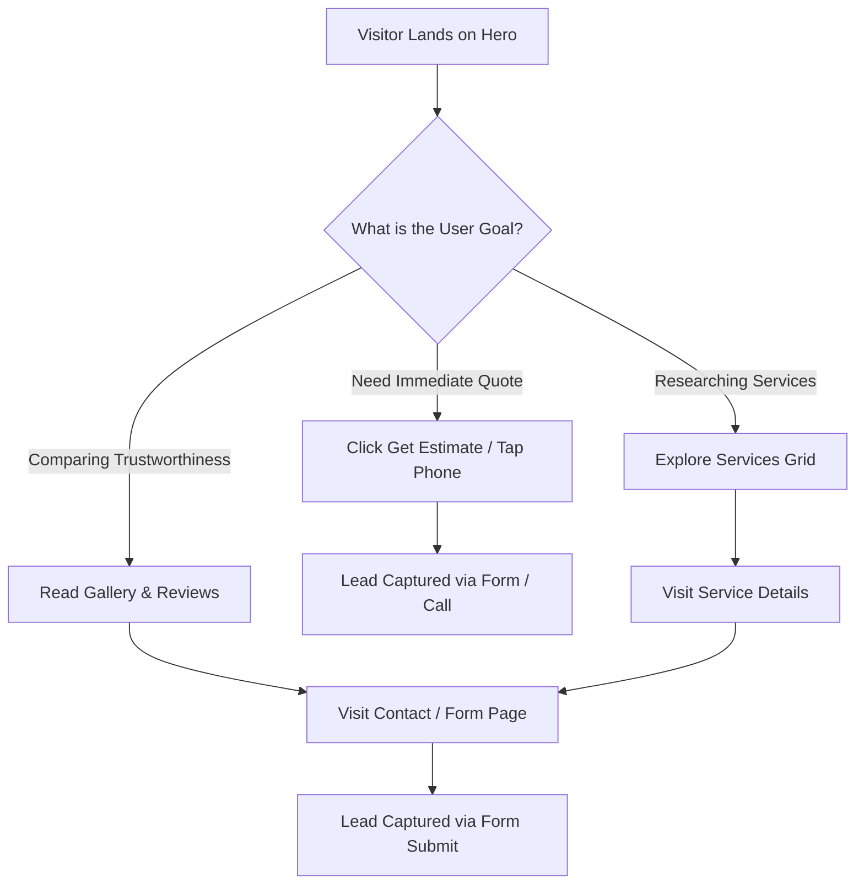

# Website Strategy & Conversion Plan
*   **Folder Location:** `strategy/website-plan.md`

---

## 1. Project Overview & Business Objective
*   **Target launch date:** August 2026
*   **Main business challenge (e.g., lack of high-value roof repair leads, low mobile conversion):** Building an authoritative local web presence that matches premium quality services, converting residential and commercial landscaping leads in Clarksville, TN.
*   **Unique Selling Proposition (USP) to feature prominently:** "One crew. Every detail." Family-owned local experts offering a 100% Satisfaction Guarantee and premium finish quality.

---

## 2. Conversion Strategy
*   **Primary Call-to-Action (CTA):** 
    *   *Action:* Submit Project Inquiry / Get a Free Estimate
    *   *Button Text:* GET A FREE ESTIMATE (Anchor to contact form)
*   **Secondary Call-to-Action (CTA):** 
    *   *Action:* Browse service portfolio / Call now
    *   *Button Text:* EXPLORE SERVICES / CALL (931) 801-6180
*   **Primary Trust Elements (Badges/Badging placement):** 
    *   "100% Satisfaction Guarantee" Badge
    *   "Licensed & Insured Team" Badge
    *   "Over 10+ Years of Local Experience" Badge
    *   5.0 Star Rated Customer Testimonials

---

## 3. Ideal Customer Profiles (ICPs)
*   **ICP 1 (Primary):**
    *   *Who they are:* Homeowners in Clarksville residential developments (Sango, Woodlawn, etc.) looking for high-quality lawn maintenance or landscape additions.
    *   *Pain point:* Unreliable contractors who skip details, leave messy borders, or fail to communicate schedules.
    *   *Buying motivation:* Professional reliability, pride in home curb appeal, and absolute trust in the crew.
*   **ICP 2 (Secondary):**
    *   *Who they are:* Property managers and commercial facility managers needing clean, regular lawn maintenance.
    *   *Pain point:* Late service, poor documentation, and unkempt borders.
    *   *Buying motivation:* Punctuality, licensing/insurance proof, and clean workmanship.

---

## 4. User Journey & Funnel Map

---

## 5. Third-Party Integrations
*   **Lead Intake:** HTML Form with built-in client-side validation, redirecting to Web3Forms / Formspree to email submissions to `Jdlawnandlandscaping14@gmail.com`.
*   **Review Feed Integration:** Embedded premium CSS-styled review cards representing verified customer testimonials.
*   **Analytics & Tracking:** Self-contained SEO-friendly design prepared for Google Analytics tag integration.
